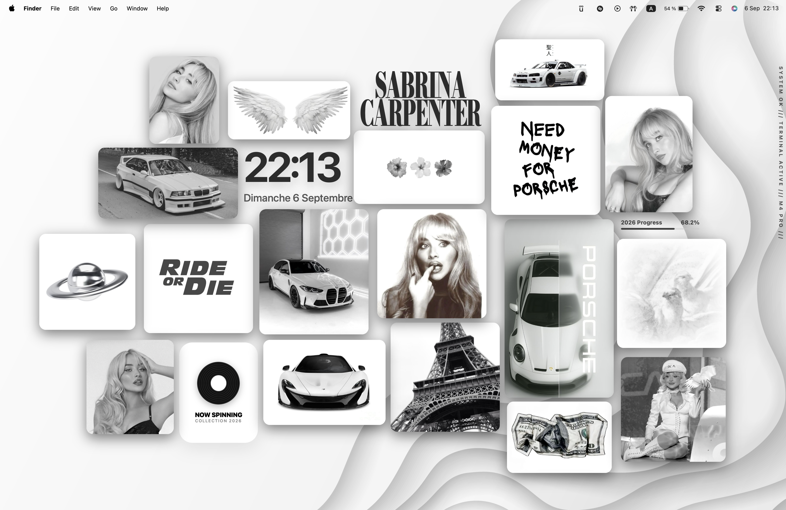
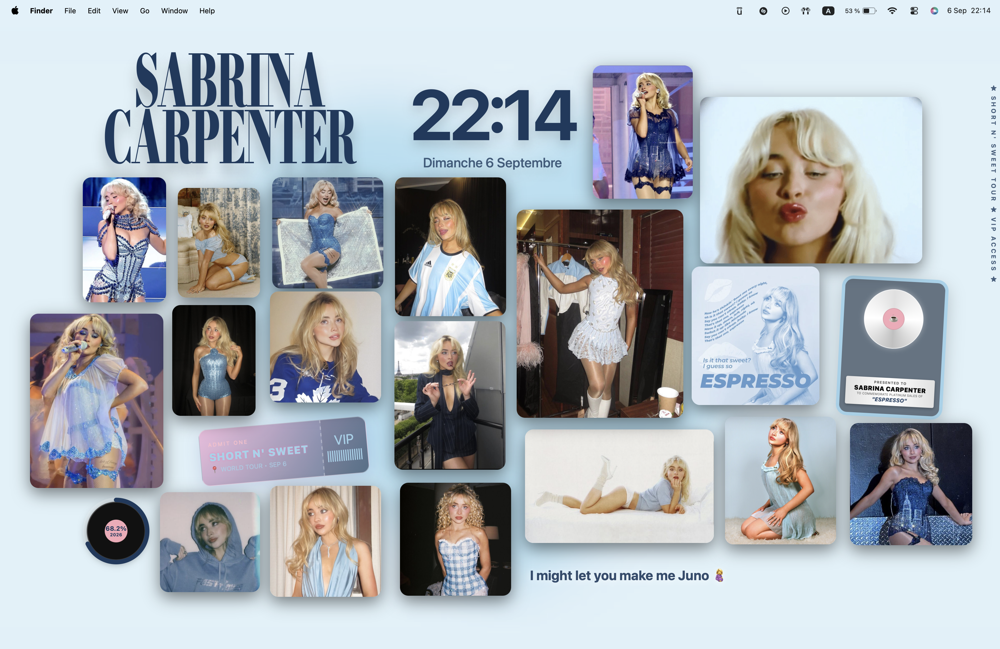
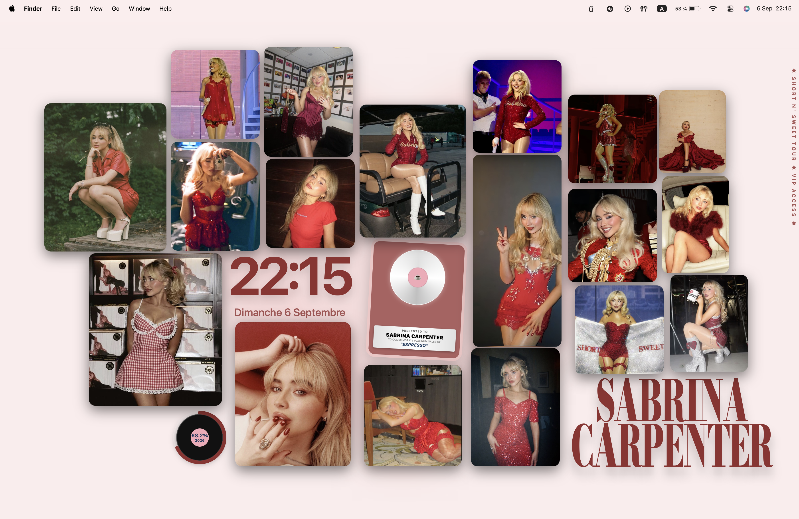
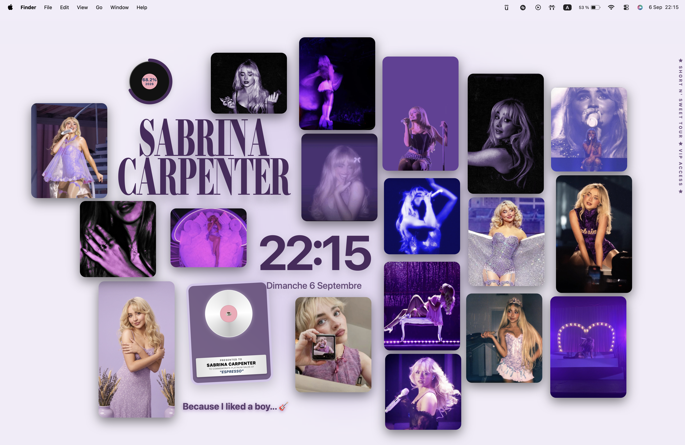

<h1 align="center">Switcher</h1>

<div align="center">
    <p>Script d'automatisation macOS pour basculer dynamiquement entre différents thèmes complets d'environnement de bureau en un instant.</p>
    
    
    
    
</div>

<br>

## Table des matières

- [Technologies utilisées](#technologies-utilisées)
- [Prérequis & Compatibilité](#prérequis--compatibilité)
- [Comment utiliser Switcher](#comment-utiliser-switcher)
- [Fonctionnalités](#fonctionnalités)
- [Guide de configuration](#guide-de-configuration)
- [Démo](#démo)
- [Structure du projet](#structure-du-projet)
- [Problèmes connus](#problèmes-connus)
- [Roadmap](#roadmap)
- [FAQ](#faq)
- [Contributeurs](#contributeurs)

# Technologies utilisées

Switcher s'appuie sur des outils en ligne de commande et des fonctionnalités natives de macOS :

- **Bash** : Cœur du script d'automatisation (gestion des processus, boucles, conditions).
- **JSON & `jq`** : Stockage et requêtage de la configuration des thèmes (coordonnées, couleurs, chemins).
- **AppleScript (`osascript`)** : Interaction avec le système macOS (fonds d'écran, mode sombre/clair, Terminal).
- **`fileicon`** : Utilitaire CLI pour la modification dynamique des icônes d'applications.
- **`dockutil`** : Utilitaire CLI pour réorganiser dynamiquement le Dock macOS.
- **Übersicht** : Moteur de rendu HTML/JS pour afficher des widgets personnalisés sur le bureau.

# Prérequis & Compatibilité

### Système supporté

Switcher est conçu spécifiquement pour l'environnement macOS moderne :

| OS | Architecture | Support complet |
|----|-------------|-----------------|
| macOS Tahoe/Sequoia/Sonoma | Apple Silicon (M1, M2, ..., M5) | ✅ Recommandé |
| macOS Ventura | Intel / Apple Silicon | ✅ |

### Dépendances requises

Avant d'utiliser le script, vous devez installer ces outils via [Homebrew](https://brew.sh/) :

```bash
brew install jq
brew install dockutil
brew tap mkchoi212/fac && brew install fileicon
```
*Note : L'application [Übersicht](https://tracesof.net/uebersicht/) doit également être installée dans le dossier `/Applications`.*

# Comment utiliser Switcher

Pour mettre en place et utiliser le script, suivez ces étapes :

1. **Cloner le dépôt et placer les données**

   Clonez le projet dans votre dossier de développement :
   ```bash
   git clone https://github.com/LoupesDEV/Switcher.git ~/Dev/Switcher
   ```

2. **Préparer l'arborescence des médias**

   Créez le dossier `~/Pictures/SWITCH/` et placez-y vos ressources (fonds d'écran, icônes, sons, widgets) en respectant la hiérarchie attendue (voir [Structure du projet](#structure-du-projet)).

3. **Exécuter le script**

   Rendez le script exécutable puis lancez-le. Le script demandera les droits `sudo` pour modifier le cache des icônes :
   ```bash
   chmod +x ~/Dev/Switcher/switcher.sh
   ./switcher.sh
   ```

> 💡 *Commandes avancées : Vous pouvez forcer un mode précis en passant des arguments. Par exemple, `./switcher.sh force normal` appliquera le thème par défaut, et `./switcher.sh force red` appliquera la variante rouge du thème.*

# Fonctionnalités

### 🎨 Thèmes Dynamiques & Variantes
- **Mode "Normal"** : Thème minimaliste, couleurs sombres (`#2C2C2C`), interface épurée.
- **Thèmes Artiste (Sabrina Carpenter)** : Un thème complet avec 6 variantes de couleurs (Bleu, Rose, Vert, Rouge, Jaune, Violet), modifiant l'intégralité du bureau avec un design "Short n' Sweet".
- **Sélection aléatoire intelligente** : Le script évite de retomber sur la même couleur deux fois de suite grâce à l'enregistrement du dernier état dans `data.json`.

### 📱 Remplacement d'Icônes & Dock
- **Changement d'icônes à la volée** : Remplace les icônes de plus de 50 applications (VS Code, Spotify, Discord, JetBrains, etc.) via `fileicon`.
- **Exécution parallèle optimisée** : Utilise un pool de jobs (max 6 processus) pour appliquer les icônes sans saturer les I/O du Mac.
- **Dock sur mesure** : Nettoie le Dock et épingle uniquement les applications essentielles selon le thème grâce à `dockutil`.

### 🧩 Widgets Übersicht Avancés
- **Coordonnées dynamiques** : Redimensionne et déplace 18+ widgets (photos, horloge, lecteur musical, paroles) en modifiant les fichiers `layout.json` de chaque widget.
- **Rafraîchissement automatique** : Relance Übersicht via AppleScript pour appliquer les changements sans délai.

### ⚙️ Intégration Système
- **Fonds d'écran** : Changement simultané sur tous les espaces de travail actifs.
- **Apparence macOS** : Bascule automatique entre le Dark Mode et le Light Mode selon le thème actif.
- **Effets sonores** : Lecture en arrière-plan d'un fichier audio (ex: `sabrina.mp3`) lors de la transition.
- **Nettoyage du cache** : Purge des démons `iconservicesagent` pour forcer l'affichage immédiat des nouvelles icônes.

# Guide de configuration

Toute l'interface est paramétrée depuis le fichier `data.json`. Voici comment le modifier :

### Structure du `data.json`

#### Gestion des couleurs et fonds d'écran
```json
{
  "theme": 1,
  "last_color": 0,
  "colors": ["red", "green", "blue", "pink", "yellow", "purple"],
  "wallpaper": {
    "normal": "normal.jpg",
    "blue": "sabrina/blue.png"
  },
  "palettes": {
    "blue": {
      "main": "#1A3A5E",
      "second": "#A0D2EB"
    }
  }
}
```

#### Configuration des Widgets
Chaque widget possède des propriétés (position, taille, couleur) spécifiques à chaque variante :

```json
"widgets": {
  "Clock": {
    "normal": "{\"top\": \"26%\", \"left\": \"31%\", \"color\": \"#2C2C2C\", \"align\": \"left\", \"size\": \"6rem\"}",
    "blue": "{\"top\": \"8.98%\", \"left\": \"41%\", \"color\": \"#1A3A5E\", \"align\": \"center\", \"size\": \"8rem\"}"
  }
}
```

OUI tout les `\` sont **obligatoires** sinon les différents fichiers `layout.json` seront faux.  

Vous pouvez trouver tout mes widgets dans le dossier `docs/widgets`, vous pouveza les reutiliser facilement en les mettant dans le dossier `/Users/USERNAME_HERE/Library/Application Support/Übersicht/widgets`

### Ajout d'une nouvelle application

Pour modifier l'icône d'une nouvelle app :
1. Ajoutez le nom exact de l'application dans le tableau `APPS_TO_ICON_SWITCH` au début du script `.sh`.
2. Placez l'image correspondante (`NomDeLApp.png` ou `.icns`) dans vos sous-dossiers `ICNS/Normal` et `ICNS/Sabrina/...`.

# Démo

<div align="center">
    <table>
        <tr>
            <td></td>
            <td></td>
        </tr>
        <tr>
            <td></td>
            <td></td>
        </tr>
    </table>
</div>

# Structure du projet

Le script requiert une arborescence stricte pour trouver les médias :

```md
Switcher/
├── switcher.sh               # Script principal exécutable
├── data.json                 # Base de données de configuration
└── README.md                 # Documentation
```

```md
~/Pictures/SWITCH/            # Dossier externe (à créer manuellement)
├── WP/                       # Fonds d'écran
│   ├── normal.jpg
│   └── sabrina/
│       └── blue.png
├── ICNS/                     # Icônes de remplacement
│   ├── Normal/
│   │   └── Spotify.png
│   └── Sabrina/
│       └── blue/
│           └── Spotify.png
├── SOUNDS/                   # Effets sonores
│   ├── normal.mp3
│   └── sabrina.mp3
└── WIDGET/                   # Ressources pour les widgets Photo Übersicht
    ├── 1/
    │   ├── normal.png
    │   └── sabrina/
    │       └── blue.png
    └── ...
```

# Problèmes connus

### Cache d'icônes macOS capricieux

> Parfois, malgré le redémarrage des services (`iconservicesagent`), le Finder ou le Dock peut afficher temporairement l'ancienne icône d'une application ou une icône générique.
>
> **Solution** : Le système finit par s'actualiser. Un redémarrage manuel du Dock (`killall Dock`) ou un log out/log in résout instantanément les caches persistants.

### Applications non standard

Certaines applications (comme les jeux Steam, Lunar Client ou certains outils XQuartz) n'ont pas un bundle ID standard reconnu immédiatement par macOS. 
- **Solution intégrée** : Le script utilise plusieurs chemins de vérification successifs (`/Applications`, `/System/Applications`, `/Applications/Utilities`) avant de faire un fallback avec `mdfind` pour localiser l'application.

# Roadmap

### 🎯 Prochaines fonctionnalités

**Versions futures**
- ???

> 📢 **Suggestions** : Proposez vos idées dans les [discussions GitHub](https://github.com/LoupesDEV/Switcher/discussions).

# FAQ

**Q : Puis-je créer mon propre thème avec ce script ?**  
R : Oui ! Ajoutez simplement une nouvelle clé dans le tableau `"colors"` du `data.json`, définissez ses positions de widgets, et créez les dossiers correspondants dans `~/Pictures/SWITCH/`.

**Q : Pourquoi le script demande-t-il mon mot de passe (`sudo`) ?**  
R : L'utilitaire `fileicon` a besoin de privilèges administrateur pour écrire dans les dossiers système des applications (`/Applications`) et forcer la mise à jour des attributs de fichiers.

**Q : Übersicht ne met pas à jour mes widgets, que faire ?**  
R : Assurez-vous que le chemin `$HOME/Library/Application Support/Übersicht/widgets/` est correct. Le script utilise AppleScript pour forcer Übersicht à s'actualiser (`osascript -e 'tell application id "tracesOf.Uebersicht" to refresh'`).

**Q : Comment revenir aux icônes d'origine de macOS ?**  
R : Vous pouvez lancer `sudo fileicon rm /Chemin/Vers/App.app` pour purger l'icône modifiée et restaurer celle incluse dans le bundle de l'application.

**Q : Je ne suis pas fan de Sabrina Carpenter, est ce que je peux changer le nom ?**  
R : C'est une manipulation un peu plus longue et pas native dans se script, mais il vous faudrat remplacer toutes les `Sabrina` **ET** `sabrina` par ce que vous voulez (pareil pour les dossiers).

# Contributeurs

Merci aux personnes et ressources ayant contribué au projet:

- [LoupesDEV](https://github.com/LoupesDEV) — Développement principal, conception et maintenance.

Vous souhaitez contribuer ? Consultez le [guide de contribution](CONTRIBUTING.md) ou ouvrez une *issue* pour proposer
des améliorations.

<p align="center">
    
    <br><br>
    
</p>